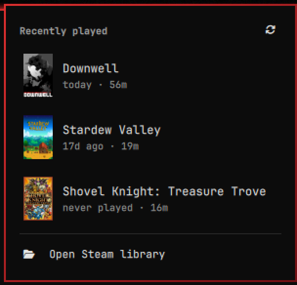

# Steam — Omarchy bar widget

A shortlist of the games you actually play, one click from the bar.



This is not a library browser. Clicking the Steam mark drops the few games you
played most recently — cover art, when you last played, how long you have
played — and clicking one launches it. There is no search box and no grid,
because at five rows there is nothing to search: the game you want is almost
always the one you played last.

Everything is read from files Steam already keeps on disk, so the panel opens
instantly whether or not Steam is running. No API key, no network call, no
account login, and nothing leaves your machine.

## Scope, and when to use something else

The whole design is one decision — show a handful of rows and get out of the
way. That makes it fast and predictable, and it makes it the wrong tool for
some jobs. The Omarchy marketplace has plugins that cover those better:

| If you want | Use |
|---|---|
| Type-to-search over the whole library, and non-Steam games | [thedarkcr0w/omarchy-games](https://github.com/thedarkcr0w/omarchy-games) |
| One list spanning Steam, Lutris, Heroic, Bottles, and Flatpak | [sir-francisdrake/game-launcher](https://github.com/sir-francisdrake/game-launcher) |
| Steam friends presence rather than launching | [daventhedude/omarchy-steam-friends](https://github.com/daventhedude/omarchy-steam-friends) |

This one stays deliberately small: Steam only, installed games only, capped at
twelve rows, no search, no aggregation. Staying small buys two things — a panel
where the game you want is already on screen, with nothing to type and nothing
to scroll, and a provider written in bash and awk, so the plugin adds no
language runtime to the long-lived shell process it lives inside.

## Install

```bash
omarchy plugin add https://github.com/Unr3leas3d/omarchy-steam-recent --enable right
```

Or clone it yourself and rescan:

```bash
git clone https://github.com/Unr3leas3d/omarchy-steam-recent \
  ~/.config/omarchy/plugins/io.github.unr3leas3d.steam-recent
omarchy-shell shell rescanPlugins
omarchy plugin enable io.github.unr3leas3d.steam-recent right
```

Drag the icon along the bar to move it; the bar writes the new position back
to `shell.json` itself.

## Using it

| Interaction | What it does |
|---|---|
| Left click | Open the panel |
| Click a game | Launch it and close the panel |
| ↑ / ↓ then Enter | Pick and launch from the keyboard |
| Esc | Close |
| Right click (bar mark) | Skip the list, open the Steam library |
| Refresh (↻, top right) | Rescan the library now |

## Settings

Set these on the widget's entry in `~/.config/omarchy/shell.json`. It
hot-reloads on save.

```json
{ "id": "io.github.unr3leas3d.steam-recent", "count": 8, "covers": true }
```

| Key | Default | Meaning |
|---|---|---|
| `count` | `5` | How many games to list (1–12) |
| `covers` | `true` | Show cover art; `false` gives a tighter text-only list |

## How it finds your games

| What | Where it comes from |
|---|---|
| Installed games | `appmanifest_*.acf` in every library in `libraryfolders.vdf` |
| Last played | `LastPlayed` in each manifest |
| Playtime | `Playtime` in each account's `userdata/*/config/localconfig.vdf` |
| Cover art | `appcache/librarycache/<appid>/library_600x900.jpg` |

`scripts/steam-recent` does the reading and prints one tab-separated row per
game. You can run it directly to see exactly what the panel sees:

```bash
~/.config/omarchy/plugins/io.github.unr3leas3d.steam-recent/scripts/steam-recent 5
```

Only installed games are listed. Proton, the Steam Linux Runtimes, and the
redistributables live in `steamapps` alongside real games and are filtered out
by name, because the manifests carry no field that distinguishes them.

## Security

Every field the panel shows comes from a file that any local process can
rewrite — `steamapps/*.acf` is not privileged — and the appid ends up
concatenated into a shell command when a row is launched. So it is validated
as a short run of digits three times over: in the provider, again when the
panel parses the provider's output, and once more at the concatenation
itself. Anything that is not digits is dropped, never escaped.

Sizes are bounded at every stage, so a corrupt or hostile file cannot hand
the long-lived shell process an unbounded string: 1 MiB per manifest, 32 MiB
per `localconfig.vdf`, 4096 bytes per line, 2000 manifests, 200 characters
per game name, and 64 KiB of total output. Names are stripped of tabs and
control characters before they share a tab-delimited line with an appid.

## Requirements

Bash, `awk` (gawk, the Arch default — the parser uses `match()` with a
capture array), and Steam. No language runtime, no extra packages.

Steam flushes playtime when it exits, so a session's minutes may not appear
until you close Steam. Last-played updates as soon as a game exits.

## Removing it

```bash
omarchy plugin remove io.github.unr3leas3d.steam-recent
```

## License

MIT — see [LICENSE](LICENSE).

Not affiliated with Valve or Steam.
